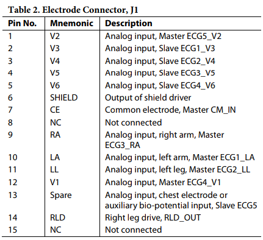
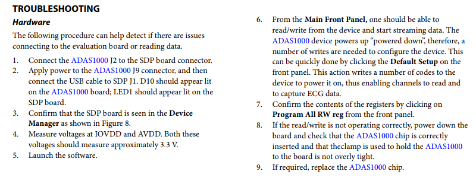

[Eval Board](http://www.analog.com/media/en/technical-documentation/user-guides/UG-426.pdf)

There are two ADAS's on the board, one master one slave for a total of 12 electrode input. We'll utilize only 5 of them from the master chip using the pins LA, RA, LL, RLD, V1, V2. RLD (Right Leg Driver) can also be used as the common mode electrode. We can choose different electrode setups after we get the hardware to work by toggling what we want to use and get the optimal setup

Pins to use from the Patient Cable: 7, 9, 10, 11, 14

If we break the D-Bus just find another from Digikey

