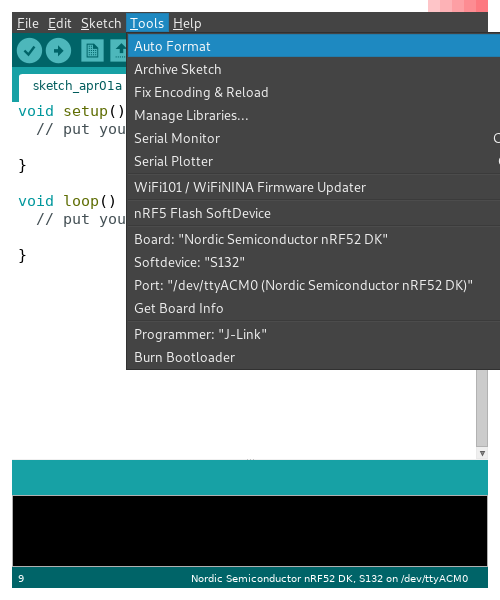
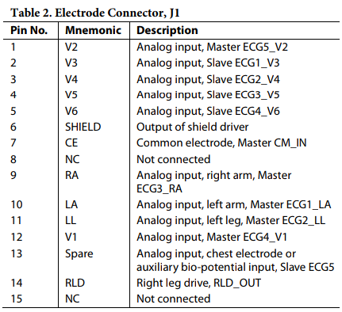
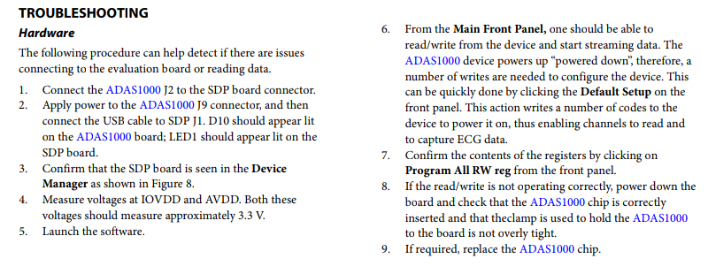
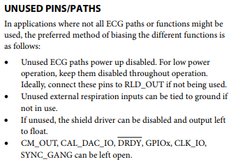
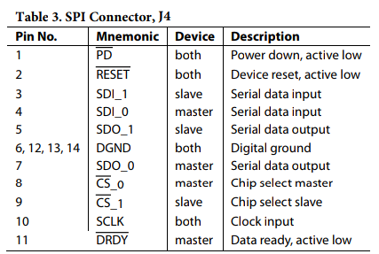
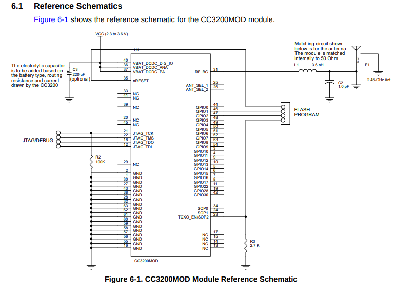

# Arias Research Group - BLE ECG

## References

### BLE

Task - Use the nRF52 Development Kit to send ECG data from the ADAS1000 over BLE to a phone to record data.

After careful assesment, I've decided to move forward with the Arduino BLEPeripheral library, after finding that someone has ported the SoftDevice functionality to Arduino IDE. This was mainly due to my unfamiliarity with the BLE stack, and the daunting, semeingly unknown and unfriendly Nordic toolchain.

To get it to work, I had to install a few packages:

```
libstdc++5
lib32-libstdc++5
libudev0-shim
gperf
lib32-attr
lib32-libcap
lib32-libgpg-error
libg32-libgcrypt
lib32-system
lib32-libudev0-shim
```

[nRF5 board files](https://github.com/sandeepmistry/arduino-nRF5)

[Arduino BLEPeripheral](https://github.com/sandeepmistry/arduino-BLEPeripheral)



### ADAS1000

[ADAS1000 Datasheet](https://www.analog.com/media/en/technical-documentation/data-sheets/ADAS1000_1000-1_1000-2.pdf)

[Eval Board Datasheet](http://www.analog.com/media/en/technical-documentation/user-guides/UG-426.pdf)

[Reference Design](https://www.analog.com/media/en/reference-design-documentation/reference-designs/CN0308.pdf)

There are two ADAS's on the eval board, one master one slave for a total of 12 electrode input. We'll utilize only 5 of them from the master chip using the pins LA, RA, LL, RLD, V1, V2. RLD (Right Leg Driver) can also be used as the common mode electrode. We can choose different electrode setups after we get the hardware to work by toggling what we want to use and get the optimal setup

SPI communication details

* Clock Polarity: Idle HIGH
* Clock Phase: Data is clocked into ADAS during the rising edges of SCLK, and shifted out (to be read) on falling edges of SCLK









[SPI Register Defs Page 60](https://www.analog.com/media/en/technical-documentation/data-sheets/ADAS1000_1000-1_1000-2.pdf)

### CC3200MOD\[DEPRACATED\] (WiFi)

[CC3200MOD Datasheet](http://www.ti.com/lit/ds/swrs166/swrs166.pdf)

[CC3200MOD LaunchPad User Guide](http://www.ti.com/lit/ug/swru397a/swru397a.pdf)

[CC3200MOD LaunchPad Schematic](http://www.ti.com/lit/df/tidrc48/tidrc48.pdf)



[CC3200 Jumper Settings](http://energia.nu/guide/install/cc3200-guide/)

[CC3200 SPI <-> ADAS1000](https://ez.analog.com/linux-device-drivers/microcontroller-no-os-drivers/f/q-a/88100/adas-1000-to-arduino-code)

[More SPI stuff](https://www.element14.com/community/thread/46120/l/adas1000-interfacing-by-arduino-uno?displayFullThread=true)


## Other Wifi Modules

[ThingSpeak](https://thingspeak.com/)

[ESP8266](https://www.sparkfun.com/products/13678)

## IoT Server

Thinger.io is pretty nice - also has good integration with the launchpad - [Link](http://docs.thinger.io/arduino/#installation)

## Parts

All SMD components will be 0602 unless specified.

[8.192MHz](https://www.digikey.com/product-detail/en/citizen-finedevice-co-ltd/CM309S8.192MABJT/300-2039-1-ND/482155)

[1uH Inductor](https://www.digikey.com/product-detail/en/tdk-corporation/MLZ2012M1R0HT000/445-8657-1-ND/3077939)

[Chip Antenna](https://www.digikey.com/product-detail/en/taiyo-yuden/AH316M245001-T/587-2200-1-ND/2002898)

[DP3T](https://www.digikey.com/product-detail/en/c-k/JS203011JCQN/CKN10725CT-ND/6137639)

[2Pin JST](https://www.digikey.com/product-detail/en/jst-sales-america-inc/B2B-XH-A(LF)(SN)/455-2247-ND/1651045)
