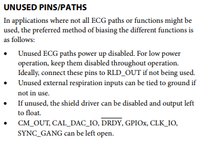
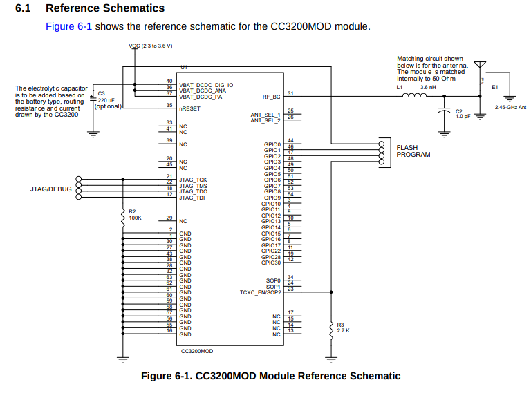

# Arias Research Group - Wifi Enabled ECG

[Eval Board](http://www.analog.com/media/en/technical-documentation/user-guides/UG-426.pdf)

[ADAS 1000](http://www.analog.com/media/en/technical-documentation/data-sheets/ADAS1000_1000-1_1000-2.pdf)

There are two ADAS's on the board, one master one slave for a total of 12 electrode input. We'll utilize only 5 of them from the master chip using the pins LA, RA, LL, RLD, V1, V2. RLD (Right Leg Driver) can also be used as the common mode electrode. We can choose different electrode setups after we get the hardware to work by toggling what we want to use and get the optimal setup

Pins to use from the Patient Cable: 7, 9, 10, 11, 14

If we break the D-Bus just find another from Digikey

9/12 testing: We got the 5 electrode ECG to work with the software. LA, RA, LL were getting good signals when using alongside RLD and CE. We tried removing RLD for fewer electrodes and turns out the default setting uses RLD as the reference drive (pg 10 Table 5) so we cannot do that until we mess with the register settings.

ADAS1000 Example Schematic: http://www.analog.com/media/en/reference-design-documentation/reference-designs/CN0308.pdf

## Flashing

There is a good chip that supposedly integrated many of the function we need on a single module: the [CC3200MOD](http://www.ti.com/product/CC3200MOD/samplebuy). [Here](https://e2e.ti.com/support/wireless_connectivity/simplelink_wifi_cc31xx_cc32xx/f/968/t/514171?Questions-about-how-to-program-a-CC3200-based-custom-board) is a forumn post that answers how to flash the chip.

## Other Wifi Modules

[ThingSpeak](https://thingspeak.com/)

[ESP8266](https://www.sparkfun.com/products/13678)

## Parts

All SMH components will be 0602 unless specified.

[8.192MHz](https://www.digikey.com/product-detail/en/citizen-finedevice-co-ltd/CM309S8.192MABJT/300-2039-1-ND/482155)

[1uH Inductor](https://www.digikey.com/product-detail/en/tdk-corporation/MLZ2012M1R0HT000/445-8657-1-ND/3077939)

## Questions for Yasser

How to route PCB Antennas? Chip Antenas? Impedence Matching? Trace Shapes?

Why does the schematic for the [CC3200MOD LaunchPadXL](http://www.ti.com/lit/df/tidrc48/tidrc48.pdf) have 3 connections to the chip antenna when I can only see [two](http://www.ti.com/lit/df/tidrc48/tidrc48.pdf)? And which direction do I connect it to?

Differential vs single (?) matching lines????

Soldering lab access (Duta's lab?)

BLE board files please - specifically interfaces and power

What did you do in terms of integration with and between projects?
